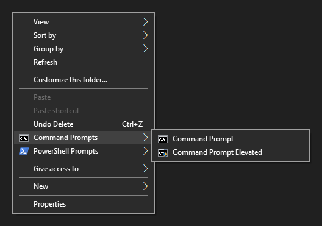

# Adding Command Prompt and PowerShell manus in Windows' right-click menu.

99% of this repository is based upon the work of Andrew Richards [(link to his article)](https://learn.microsoft.com/en-us/archive/blogs/andrew_richards/enhancing-the-open-command-prompt-here-shift-right-click-context-menu-experience).

The examples from the original article had some issues.  Sure, it would work just fine, but it threw up some errors.  I fixed it by only removing the Extended Menu (Shift-Right Click) entries, and also privided the uninstall script.

If there are any issues in your testing please let me know.  I have only been using this on Windows 10, but it should work on any version down to 7 - provided PowerShell is enabled.

Here is a snapshot of what it will look like on Windows 10...

## Dummy License

Permission is hereby granted, free of charge, to any person obtaining a copy
of this software and associated documentation files (the "Software"), to deal
in the Software without restriction, including without limitation the rights
to use, copy, modify, merge, publish, distribute, sublicense, and/or sell
copies of the Software, and to permit persons to whom the Software is
furnished to do so, subject to the following conditions:

No conditions.

THE SOFTWARE IS PROVIDED "AS IS", WITHOUT WARRANTY OF ANY KIND, EXPRESS OR
IMPLIED, INCLUDING BUT NOT LIMITED TO THE WARRANTIES OF MERCHANTABILITY,
FITNESS FOR A PARTICULAR PURPOSE AND NONINFRINGEMENT. IN NO EVENT SHALL THE
AUTHORS OR COPYRIGHT HOLDERS BE LIABLE FOR ANY CLAIM, DAMAGES OR OTHER
LIABILITY, WHETHER IN AN ACTION OF CONTRACT, TORT OR OTHERWISE, ARISING FROM,
OUT OF OR IN CONNECTION WITH THE SOFTWARE OR THE USE OR OTHER DEALINGS IN THE
SOFTWARE.
